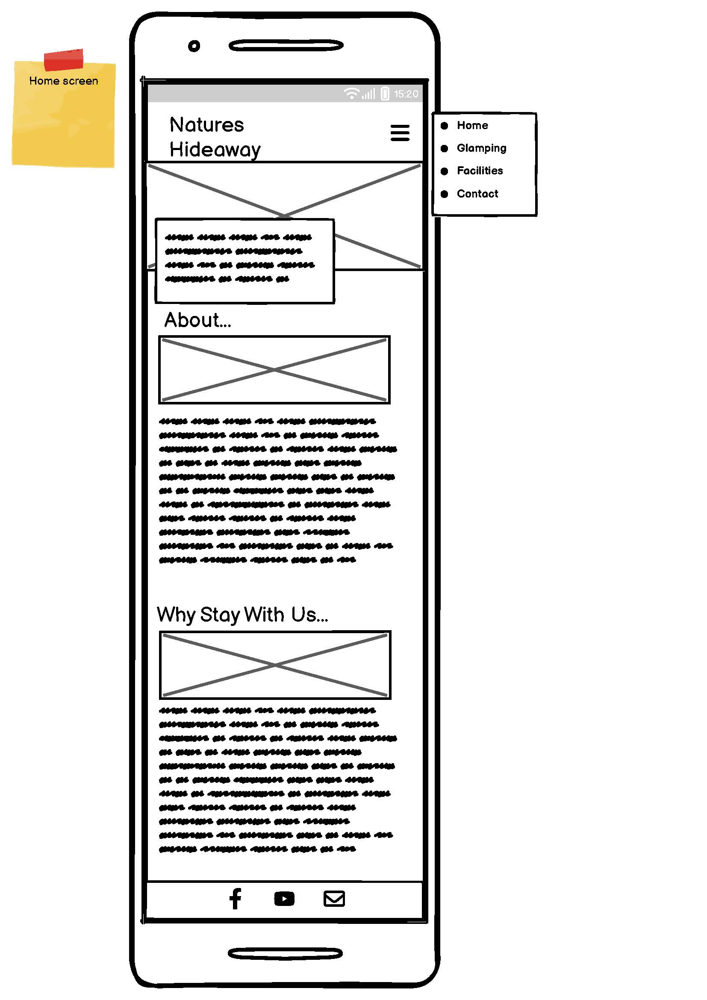
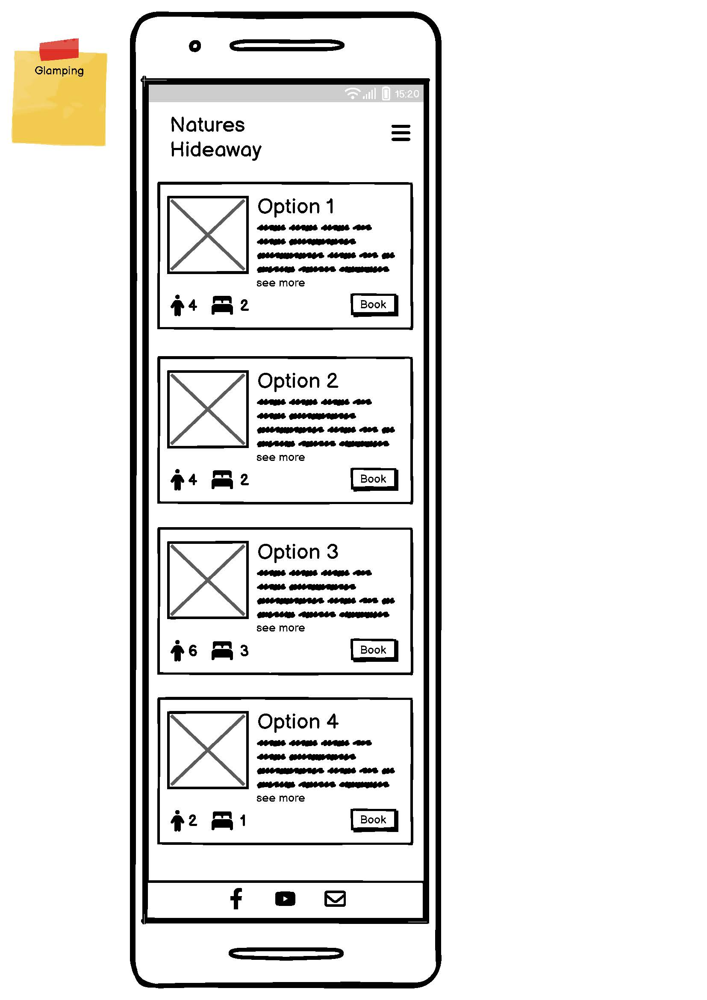
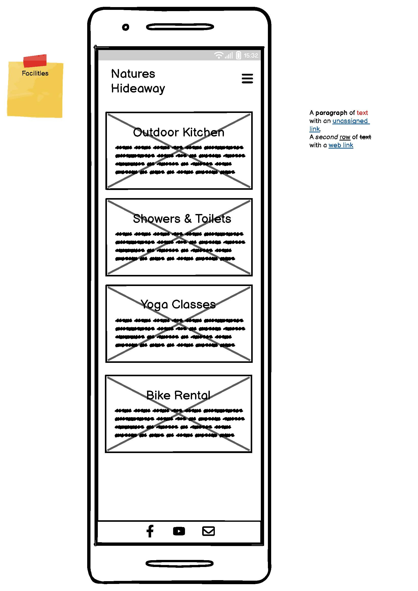
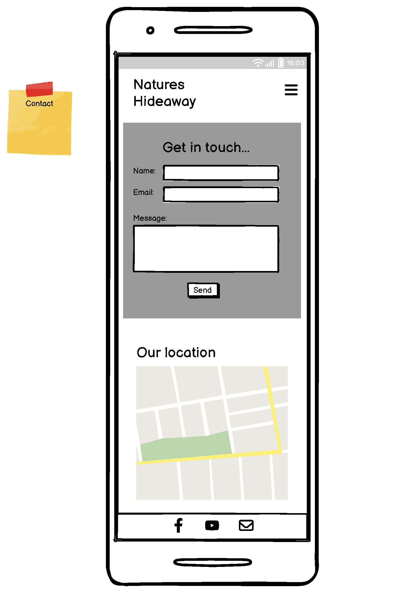
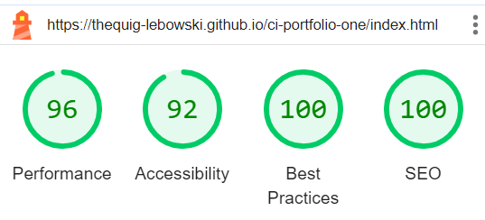

# Natures Hideaway

This is a static website for a fictional glamping site located somewhere on the West coast of Ireland, between the ocean and the mountains. 

https://thequig-lebowski.github.io/ci-portfolio-one/

---

## Contents

1. [UX](#UX)
	* [Strategy](#Strategy) 
	* [Scope](#Scope)
	* [Structure](#Structure)
	* [Skeleton](#Skeleton)
	* [Surface](#Surface)
2. [Features](#Features)
	* [Existing Features](#Existing-Features)
	* [Future Features](#Future-Features)
3. [Technologies Used](#Technologies-Used)
4. [Testing](#Testing)
	* [Device Testing](#Device-Testing)
	* [Validation](#Validation)
5. [Deployment](#Deployment)
6. [Credits](#Credits)
	* [Code](#Code)
	* [Images](#Images)
 

---

## UX
### Strategy

The primary objective of this website is to showcase Natures Hideaway glamping site as an attractive destination for anyone looking to explore the outdoors while still enjoying an element of luxury. The business objectives can be measured by how many enquires to book there are.

### Scope

Utilising a minimalist styling, the website is simply laid out, allowing the user to navigate intuitively, browsing accomadtion types and also finding out about other facilaties and nearby attraction.

### Structure

This fictional glamping site currently has four types of accommodation, but allowing for growth and development of the business I wanted to make this easily scalable. With that in mind and designing for mobile first, I went with an instagram-style card layout. Where each option from the glamping.html page would appear in single file, one directly under the previous. This also made changing the layout for larger screens straight forward.

### Skeleton

 
There are one or two slight differences from the wireframe mockup to the actual site, most notably is the omission of the fourth 'Facilities' page. Although this is not in the current site I think it would be a good idea for future features of the project.

I decided to prioratise key pieces of information, making them visible to the user without the need for any extra navigation. The number of beds a dwelling has and the number of people it can accommodate are ranked top, they were given easily recognisable icons that that sit neatly at the bottom of each dwelling card. Next or just as important, was the call to action 'Book' button, which invited users to book that accommodation right away. For the scope of this project, this call to action directs the user to the contact page where they can send a message.

### Surface

I chose to have a banner image across the top of each page, this helps let the user know where they are on the site, providing some consistancey throughout. As I mentioned before I wanted to keep things minimalistic as I feel to that helps convey the bit of luxury that Natures Hideaway offers.

---

## Features
### Existing Features
#### Responsive
This site was designed mobile-first and as such already looks great and works perfectly on all mobile devices. It has a drop down navigation menu, which frees up space from the header. On larger screens all the navigation links are visible, saving the user precious clicks while also adding visual balance to the top of the page.

#### Contact Form
Throuhout the website the user always has the opportunity to get in touch to either book accommodation or find out more through the contact form on the contact page.

#### Embedded Map
The addition of the embedded map provides a familiar tool to most users, allowing them to quickly orient themselves to where they would be visiting. It's quite likely that a visitor to Natures Hideaway is not local to the area, so providing a map and address will only be beneficial.

#### Social Links
Social media is a great option for users to get more information about a place. It also provides a bit of authenticity as well as an option for them to get in touch.

### Future Features
#### Facilaties Page
As already mentioned, a simple way to improve the site as well as help the user gain a more rounded view of the destination would be the addition of the fourth facilaties page. This page would list in detail the ammenaties found at Natures Hideaway; the outdoor kitchen and pizza oven, the showers and bathrooms as well as a the yoga studio.

#### Booking Function
Allowing the user to book by inputting check in/out dates would be a great addition, as most users are accustomed to making reservations online in this way.

#### Image Gallery
Another feature to add would be a image carousel, allowing the user to scroll through multiple photos of each dwelling type.

## Technologies Used
* HTML - The main structure and layout of the page
* CSS - The styling of the page
* Photoshop - Any images that needed to be cropped or resized
* Gitpod.io - used as the environment to develop the project
* Chrome Dev Tools - Used constantly throuhout development to help identify and squash bugs
* Github - used for version control
* Github Pages - this project is currently hosted on Github Pages
* Google Fonts - used to style the main section of the game
* Lighthouse - used for testing the performance and accessibility of the site
* W3C Markup Validator - used to check the markup of the site and ensure there were no major errors.

## Testing
### Device Testing
* From very early in devolpment the site was hosted live on github pages, this allowed me thoroughly check everything was working. One problem I encountered early on was incorrect file paths, I had started using absolute file paths but soon realised this wouldn't work universally so I changed it to relative file paths.

* As the page was live I was able to test the site throughout development on several different devices; laptops, desktops and mobile devies.

* I was also careful to meticulously and methodically test that all links worked, both external and internal.

### Validation

