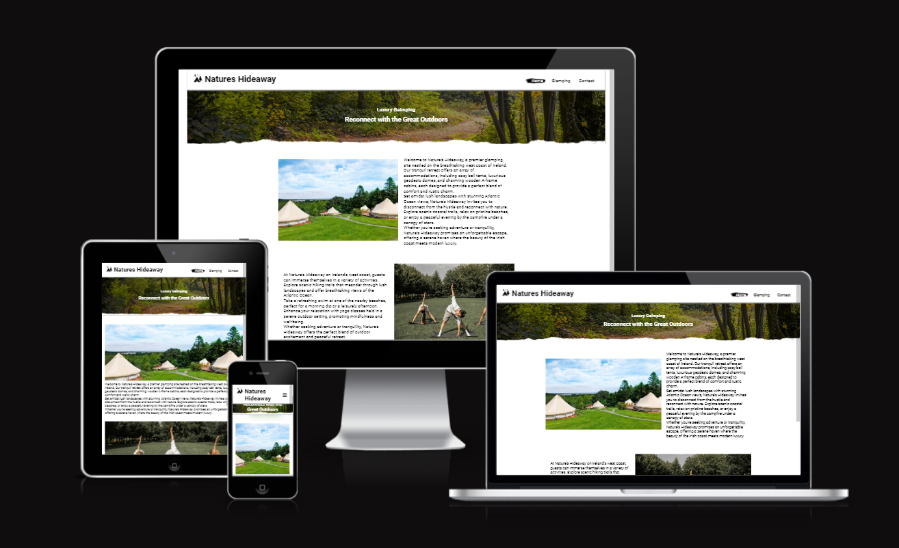

# Natures Hideaway

This is a static website for a fictional glamping site located somewhere on the West coast of Ireland, between the ocean and the mountains. 

https://thequig-lebowski.github.io/ci-portfolio-one/

---

## Contents

1. [UX](#UX)
	* [Strategy](#Strategy) 
	* [Scope](#Scope)
	* [Structure](#Structure)
	* [Skeleton](#Skeleton)
	* [Surface](#Surface)
	* [User Stories](#User-Stories)
	* [Design](#Design)
2. [Features](#Features)
	* [Existing Features](#Existing-Features)
	* [Future Features](#Future-Features)
3. [Technologies Used](#Technologies-Used)
4. [Testing](#Testing)
	* [Testing User Stories](#Testing-User-Stories) 
	* [Unit Testing](#Unit-Testing)
	* [Device Testing](#Device-Testing)
	* [Validation](#Validation)
5. [Deployment](#Deployment)
6. [Credits](#Credits)
	* [Code](#Code)
	* [Images](#Images)
 

---

## UX
### Strategy